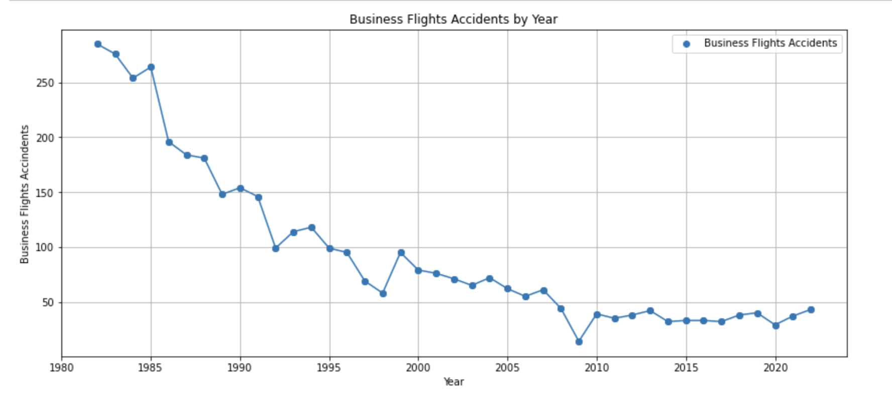
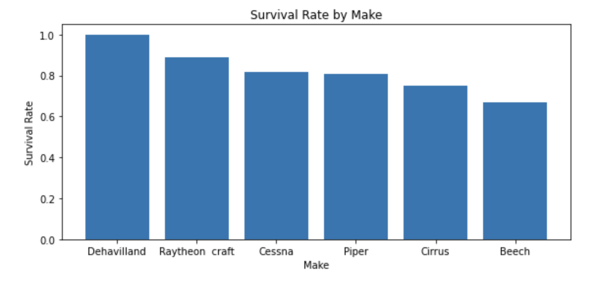
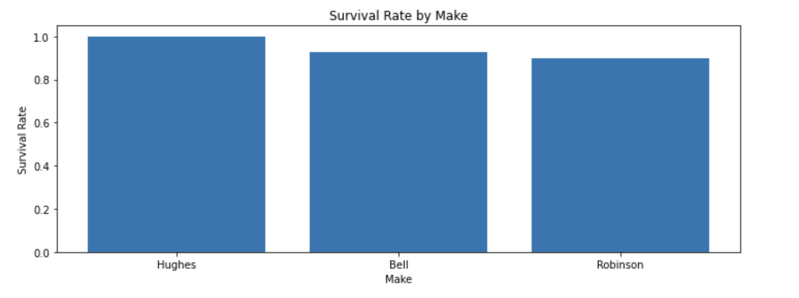
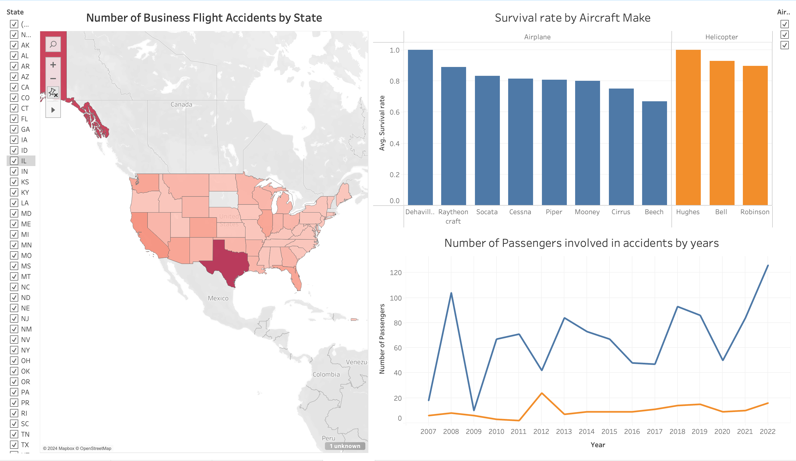

## Aviation Accidents Analysis

### Overview 

The project aims to support the development of a new aviation business line by providing three business recommendations based on thorough data analysis. The objective is to identify the lowest-risk aircraft makes and models for the company to consider for its new aviation ventures. 

The presented analysis focuses on key variables such as aircraft make and model, fatalities, time of accidents and accident locations. By addressing missing data, interpreting and visualizing the information, the analysis seeks to offer data-driven insights.

The findings will help the company mitigate potential risks and make informed decisions about aircraft purchases, ensuring a safe and strategic entry into the aviation market.

### Source of data

Main data source is The National Transportation Safety Board aviation accident dataset with information from 1962 and later about civil aviation accidents and selected incidents within the United States, its territories and possessions, and in international waters. Detailed accidents reports can be accessed on NTSB website.

Initial Dataset: 88889 rows, 31 columns 

Data on accident: Event Id, Investigation Type, Accident Number, Event Date, Location, Country, Latitude, Longitude, Airport Code, Airport Name, Injury Severity, Aircraft Damage, Aircraft Category, Registration Number, Make, Model, Amateur Built, Number Of Engines, Engine Type, FAR Description, Schedule, Purpose Of Flight, Air Carrier, Total Fatal Injuries, Total Serious Injuries, Total Minor Injuries, Total Uninjured, Weather Condition, Broad Phase Of Flight, Report Status, Publication Date.

### Data Understanding and Analysis

In this analysis we focus on business charter flights in two categories - airplanes and helicopters in the United States. We analyse relevant accidents - dated after 2005, as the aircarft industry has developed significantly and older data points can distort the findings. As an outcome of this analysis we will be able to provide lists of recommended makes and models for both categories based on calculating accident survival rates.

Business flights accidents rates over the years

Survival rate for airplane business flight by make

Survival rate for helicopter business flight by make

Tableau dashboard

### Summary

Based on the analysis of the provided aviation accidents data, here are the key findings and actionable insights to help decide which aircraft to purchase for the new aviation division:

#### Business Airplane Flights Division:

Prioritize when considering airplanes from following manufacturers: Piper, Cessna, Cirrus.
Airplanes Models to consider:
* Piper - M350 and M500 (formerly PA-46).
* Cessna - Citation line, Model 525 and 700.
* Cirrus - SR 22.

States with higher risk to avoid: Alaska, Texas.
July and August are higher risk months, lowest risk are December and January.

#### Business Helicopter Flights Division:
Prioritize when considering helicopters from following manufacturers: Bell Make and Robinson.
Helicopters Models to concider:
* Robinson R44 and R44 II.
* Bell 407.

States with higher risk to avoid: Texas, Arizona.
August and September are higher risk months, lowest risk are December through April.

#### Links

[Github repository for the project](https://github.com/dolgorp/phase1_project)

[Tableau dashborad](https://public.tableau.com/app/profile/dolgor.purbueva/viz/AviationAccidentsProject/Dashboard)
